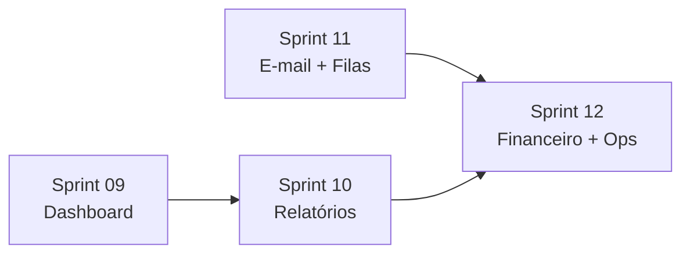

# Horizonte 1 — Consolidar operação e confiança

## Visão

Fechar lacunas entre **o que já está implementado** (Sprints 01–07 + polimento portal + financeiro completo) e **o que um escritório precisa para usar o Docflow no dia a dia com confiança**, sem abrir módulos novos de negócio (CRM, vertical, IA).

## Objetivo do horizonte

- Dono/gestor enxerga **pendências críticas** no dashboard e age com um clique.
- Relatórios podem ser **exportados** e **agendados com execução real** (mesmo que entrega seja interna/simulada).
- Comunicações transacionais **saem de verdade** (e-mail + fila configurada).
- Cliente inadimplente é **alertado no portal**; equipe registra cobrança.
- Operação tem **visibilidade** de jobs e auditoria relevante.

## Duração estimada

| Sprint | Foco | Duração sugerida |
|--------|------|------------------|
| [Sprint 09](../sprint-09-dashboard-alertas/TASKS.md) | Dashboard e alertas operacionais | 3–5 dias |
| [Sprint 10](../sprint-10-relatorios-export-agendamento/TASKS.md) | Exportação web e job de relatórios | 4–6 dias |
| [Sprint 11](../sprint-11-email-filas-producao/TASKS.md) | E-mail transacional e filas | 3–5 dias |
| [Sprint 12](../sprint-12-financeiro-portal-operacao/TASKS.md) | Cobrança ↔ portal + observabilidade | 4–6 dias |

**Total:** ~2–4 semanas (1 dev), dependendo de paralelismo e testes.

## Dependências entre sprints

- **Sprint 09** pode começar imediatamente.
- **Sprint 10** reutiliza `ReportMetrics` (já usado no dashboard).
- **Sprint 11** desbloqueia entregas reais da Sprint 10 e alertas da Sprint 12.
- **Sprint 12** assume fila funcional (Sprint 11) para lembretes automáticos opcionais.

## O que já existe (não refazer)

| Área | Estado atual |
|------|----------------|
| Relatórios web/API | `/reports`, filtros salvos, relatório mensal, liberação ao portal |
| Export CSV | Apenas `POST /api/v1/reports/export` com auditoria |
| Agendamentos | Tabela `report_schedules`, cadastro web — **sem job de execução** |
| Dashboard | Métricas de clientes + alguns KPIs; alertas básicos sem financeiro |
| E-mail | `PortalClientAlertNotification`, reset de senha — **mailer `log`/`array` em dev** |
| Financeiro | Recorrência, renegociação, lembrete manual registrado |
| Portal cliente | Alertas in-app + e-mail enfileirado |
| Scheduler | `finance:generate-recurring-receivables` diário |

## Métricas de sucesso do horizonte

1. Gestor abre `/dashboard` e resolve ≥ 3 tipos de pendência via link direto (tarefa, documento, cobrança).
2. Relatório agendado mensal gera `GeneratedReport` e registra `last_run_at` sem duplicidade.
3. E-mail de reset de senha / alerta ao cliente chega em Mailpit (dev) ou provedor (staging).
4. Cobrança vencida dispara alerta no portal do cliente após job ou ação da equipe.
5. Falha de job fica registrada (`failed_jobs` ou log dedicado) e auditável.

## Fora do horizonte 1

- Gateway de pagamento (Pix, boleto, cartão).
- WhatsApp Business real.
- CRM, contratos, automações genéricas (Horizonte 2).
- BI avançado, app mobile nativo.
- Google Calendar / Outlook.

## Próximo horizonte

[Horizonte 2 — Administração da plataforma e assinaturas](../horizonte-02-platform-billing/README.md) (Sprints 13–16).
