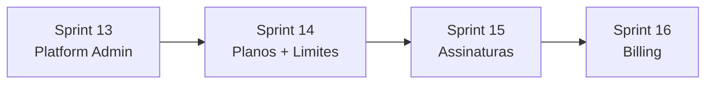

# Horizonte 2 — Administração da plataforma e assinaturas

## Visão

Introduzir a camada **SaaS** do Docflow: operadores da plataforma gerenciam tenants (organizações), planos comerciais e assinaturas; tenants respeitam limites de plano e status de billing para acessar o sistema.

## Objetivo do horizonte

- Equipe Docflow acessa painel **`/platform`** para listar, inspecionar e controlar organizações (suspender, reativar, alterar plano).
- Catálogo de **planos** (Essencial, Profissional, Escritório) com limites e features mapeados aos módulos existentes.
- Cada organização possui **assinatura** com trial, ciclo de vida e enforcement de acesso (web, API e portal).
- Admin da organização consulta **plano e uso**; billing self-service ou manual conforme fase.
- Toda ação sensível de platform admin é **auditada** separadamente da auditoria por tenant.

## Duração estimada

| Sprint | Foco | Duração sugerida | Status |
|--------|------|------------------|--------|
| [Sprint 13](../sprint-13-platform-admin-fundacao/TASKS.md) | Fundação platform admin + gestão de tenants | 4–6 dias | ✅ |
| [Sprint 14](../sprint-14-planos-limites/TASKS.md) | Catálogo de planos e engine de limites | 4–6 dias | ✅ |
| [Sprint 15](../sprint-15-assinaturas-ciclo-vida/TASKS.md) | Assinaturas, trial e enforcement de acesso | 5–7 dias | ✅ |
| [Sprint 16](../sprint-16-billing-self-service/TASKS.md) | Billing, faturas e self-service do tenant | 5–8 dias | ✅ MVP |

**Total:** ~3–5 semanas (1 dev), dependendo do gateway escolhido na Sprint 16.

## Dependências entre sprints

- **Sprint 13** pode começar imediatamente após Horizonte 1.
- **Sprint 14** depende do painel platform para CRUD de planos (ou seed inicial).
- **Sprint 15** exige planos e `PlanLimitChecker` da Sprint 14.
- **Sprint 16** assume assinatura e middleware de acesso da Sprint 15.

## O que já existe (não refazer)

| Área | Estado atual |
|------|----------------|
| Tenant | `Organization` com `status: active \| suspended` |
| Membros / roles | `OrganizationMember` + Spatie teams por `organization_id` |
| Contexto org | `WebOrganizationContext`, `EnsureOrganizationIsActive` (API) |
| Super-admin hook | `Gate::before` + role `super-admin` no seeder — **sem UI nem fluxo** |
| Auditoria tenant | `audit_logs` + página `/audit` (admin/manager da org) |
| Financeiro interno | Recebíveis/pagáveis do escritório — **não é billing SaaS** |
| Briefing comercial | Planos Essencial / Profissional / Escritório em `docs/briefing_app_gestao_escritorios.md` |
| Doc técnico | Entidades `plans` e `subscriptions` planejadas, não implementadas |

## Decisões de produto (fechar no kickoff da Sprint 13)

| # | Decisão | Default sugerido |
|---|---------|------------------|
| 1 | Identificação platform admin | `users.is_platform_admin` (boolean) |
| 2 | Trial na criação de org | 14 dias no plano Essencial |
| 3 | Grace period inadimplência | 7 dias antes de suspender |
| 4 | Gateway MVP (Sprint 16) | Manual + faturas registradas pelo platform admin |
| 5 | Self-service signup | Aberto com trial (sem checkout obrigatório no MVP) |
| 6 | Impersonação | Fora do MVP — Sprint futura |

## Métricas de sucesso do horizonte

1. Platform admin suspende org → usuários da org recebem 403 em web, API e portal.
2. Org no trial vê banner e data de expiração; após expirar, acesso bloqueado até regularização.
3. Plano Essencial impede convite além de `max_members` com mensagem clara (`plan_limit_exceeded`).
4. Platform admin altera plano de tenant e limites refletem em até 1 request.
5. Admin da org vê página “Plano e uso” com consumo vs limites.
6. (Sprint 16) Fatura paga manualmente ou via webhook reativa assinatura `past_due`.

## Fora do horizonte 2

- CRM, contratos, automações genéricas (Horizonte 3).
- Múltiplas unidades/filiais por org.
- BI avançado, MRR dashboard completo.
- Impersonação de usuário tenant.
- Gateway Pix/boleto/cartão **do financeiro interno** (continua separado do billing SaaS).

## Próximo horizonte

[Horizonte 3 — Comercial do SaaS e operação do escritório](../horizonte-03-comercial-operacao/README.md) (Sprints 17–20: Asaas → CRM → contratos → automações).

## Referências

- `docs/briefing_app_gestao_escritorios.md` — seção 19 (planos comerciais)
- `docs/documento_tecnico_app_gestao_escritorios.md` — seções 6.2 (tenancy), 14 (pagamentos)
- `app/Models/Organization.php`
- `app/Http/Middleware/EnsureOrganizationIsActive.php`
- `database/seeders/PermissionSeeder.php` — role `super-admin` (não reutilizar para platform admin)
