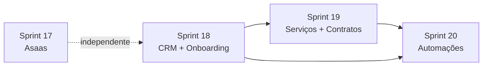

# Horizonte 3 — Comercial do SaaS e operação do escritório

## Visão

Fechar o **loop de pagamento externo** do Docflow (Asaas) e abrir os primeiros módulos comerciais do tenant: **CRM**, **serviços/contratos** e **automações simples** — o que o briefing chama de jornada “oportunidade → contrato → operação recorrente”, sem entrar ainda em verticais (jurídico/contábil) nem IA.

## Objetivo do horizonte

- Platform/billing: assinatura SaaS pode ser cobrada via **Asaas** (Pix/boleto/cartão), com webhook idempotente reativando `past_due`.
- Escritório cadastra **leads**, move no funil, registra follow-ups e **converte em cliente** sem perder histórico.
- Escritório define **catálogo de serviços**, vincula ao cliente e controla **contratos** (vigência, renovação, escopo).
- Automações **simples e auditáveis** (gatilho → ação) cobrem onboarding e lembretes operacionais, respeitando feature `automations` do plano.

## Decisão de ordem (kickoff)

| # | Decisão | Default |
|---|---------|---------|
| 1 | Primeira sprint do horizonte | **Asaas** (fecha stretch da Sprint 16; config `ASAAS_*` já existe) |
| 2 | CRM antes de contratos | Sim — conversão lead→cliente alimenta contratos |
| 3 | Onboarding | Checklist + tarefas/docs na Sprint 18; cobrança recorrente amarra na 19/20 |
| 4 | Escopo da Sprint 08 antiga | **Superseded** — decomposta aqui; verticais/IA ficam fora |
| 5 | Gateway financeiro interno do escritório | Fora — continua separado do billing SaaS |

## Duração estimada

| Sprint | Foco | Duração sugerida | Status |
|--------|------|------------------|--------|
| [Sprint 17](../sprint-17-asaas-billing-gateway/TASKS.md) | Gateway Asaas + webhooks reais | 4–6 dias | ⬜ |
| [Sprint 18](../sprint-18-crm-onboarding/TASKS.md) | CRM (leads/funil) + onboarding | 6–8 dias | ⬜ |
| [Sprint 19](../sprint-19-servicos-contratos/TASKS.md) | Serviços e contratos | 5–7 dias | ⬜ |
| [Sprint 20](../sprint-20-automacoes-simples/TASKS.md) | Automações simples + logs | 5–7 dias | ⬜ |

**Total:** ~3–5 semanas (1 dev).

## Dependências entre sprints

- **Sprint 17** pode rodar em paralelo com 18 (domínios distintos: platform billing vs tenant CRM).
- **Sprint 19** depende de cliente/CRM estáveis (conversão + ficha).
- **Sprint 20** ganha valor real com gatilhos de contrato/serviço; MVP pode começar com gatilhos já existentes (cliente criado, documento vencendo, cobrança vencida).

## O que já existe (não refazer)

| Área | Estado atual |
|------|----------------|
| Billing SaaS MVP | `ManualBillingGateway`, faturas, self-service, `ProcessBillingWebhook`, scheduler |
| Config Asaas | `config/docflow.php` → `billing.asaas_*` + `.env.example` |
| Planos / features | Feature `automations` nos planos Profissional/Escritório |
| Clientes / docs / tarefas / financeiro / portal | Horizontes 1–2 |
| Templates | `MessageTemplate`, `TaskTemplate` |
| Sprint 08 monólito | Documento legado — **não implementar como está** |

## Métricas de sucesso do horizonte

1. Webhook Asaas `PAYMENT_RECEIVED` (ou equivalente) marca fatura `paid` e reativa subscription `past_due` **uma única vez**.
2. Lead convertido vira `Client` com atividades/propostas preservadas.
3. Contrato com `ends_at` aparece em alerta/consulta de renovação (dashboard ou listagem).
4. Automação “cliente criado → criar tarefas do template X” roda 2x sem duplicar efeitos.
5. Org no plano Essencial (sem `automations`) recebe 403/422 claro ao tentar ativar regra.

## Fora do horizonte 3

- Verticais: jurídico, contábil, BPO, consultoria (ex-Sprint 08).
- Base de conhecimento completa.
- WhatsApp Business API de produção.
- IA assistida.
- LGPD avançada (export/anonimização formal) além do consentimento já existente.
- Impersonação platform → tenant.
- NF-e/NFS-e.

## Referências

- `docs/briefing_app_gestao_escritorios.md` — §§ 7.3, 7.4, 7.5, 7.16
- `docs/casos_de_uso_app_gestao_escritorios.md` — UC-024–037, UC-119–126
- `docs/documento_tecnico_app_gestao_escritorios.md` — módulos CRM / ServicesContracts / Automation
- [Sprint 16](../sprint-16-billing-self-service/TASKS.md) — stretch Asaas
- [Sprint 08](../sprint-08-automacoes-integracoes-modulos/TASKS.md) — backlog legado (superseded)
- [ACTIVE.md](../ACTIVE.md)

## Próximo horizonte (rascunho)

Horizonte 4 — verticais e inteligência: módulo jurídico **ou** contábil primeiro (decisão de GTM), base de conhecimento, WhatsApp oficial, IA revisável.
