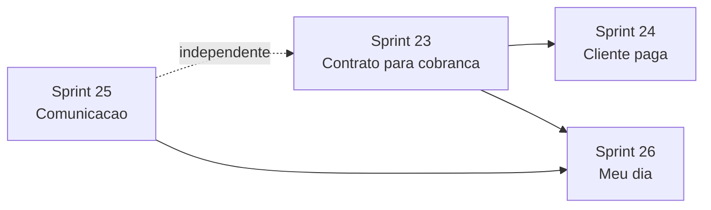

# Horizonte 5 — Rotina que segura o escritório

## Visão

Fechar os buracos do **dia a dia genérico** antes de abrir verticais: contrato que vira mensalidade, cliente que paga, comunicação que sai de verdade, e uma fila “meu dia”. O núcleo (cliente → operação → dinheiro → portal → prova de valor) já existe; falta ele substituir planilha e WhatsApp solto.

## Objetivo do horizonte

- Ativar/renovar contrato recorrente cria (com flag explícita) `ReceivableRecurrence`; cancelar pausa a cobrança.
- Cliente do escritório consegue **pagar** a cobrança (Pix/boleto do tenant), separado do billing SaaS.
- Escritório envia mensagens em lote com status; automação usa `send_message_template` (e-mail/portal); atalho `wa.me` sem Business API.
- Membro vê uma fila única do dia e pacotes mensais de documentos por serviço.

## Decisão de ordem (kickoff)

| # | Decisão | Default |
|---|---------|---------|
| 1 | Verticais jurídico/contábil | **Fora** — Horizonte 6, após 2–3 escritórios reais |
| 2 | Primeira sprint | Contrato → cobrança (leftover Sprint 19) |
| 3 | Gateway do cliente (Sprint 24) | Asaas **por organização**, separado do Asaas SaaS |
| 4 | WhatsApp Business API | Fora deste horizonte — só `wa.me` + templates |
| 5 | IA / KB / impersonação / NF-e | Fora |

## Duração estimada

| Sprint | Foco | Duração sugerida | Status |
|--------|------|------------------|--------|
| [Sprint 23](../sprint-23-contrato-gera-cobranca/TASKS.md) | Contrato gera cobrança recorrente | 2–3 dias | ✅ |
| [Sprint 24](../sprint-24-cliente-paga-cobranca/TASKS.md) | Cliente paga (Pix/boleto do tenant) | 5–7 dias | ✅ |
| [Sprint 25](../sprint-25-comunicacao-real/TASKS.md) | Envio em lote + template + wa.me | 4–6 dias | ✅ |
| [Sprint 26](../sprint-26-meu-dia-ciclo-mensal/TASKS.md) | Fila “Meu dia” + pacote documental | 4–6 dias | ⬜ |

**Total:** ~3–4 semanas (1 dev).

## Dependências entre sprints

- **Sprint 23** desbloqueia o loop dinheiro (MRR do dashboard = recorrência real).
- **Sprint 24** assume recorrências existindo; pode começar o desenho do gateway em paralelo.
- **Sprint 25** é independente de pagamento; ganha valor com filtros de inadimplência da 23/24.
- **Sprint 26** reutiliza alertas do dashboard e solicitações documentais já existentes.

## O que já existe (não refazer)

| Área | Estado atual |
|------|----------------|
| Contratos / serviços | Sprint 19 — `CreateContract`, `RenewContract`, `CancelContract` |
| Recorrência financeira | `ReceivableRecurrence` + `GenerateReceivableRecurrences` (cadastro manual) |
| Asaas | Apenas billing **SaaS** (`config/docflow.php` + webhook) |
| Templates | `MessageTemplate` com canal `whatsapp` — sem envio real |
| Automações | Tarefa, solicitação de doc, notificar equipe — sem `send_message_template` |
| Portal financeiro | `payment_instructions` (texto PIX) |
| Dashboard | Resultado, MRR estimado, ROI de automações (H4) |

## Métricas de sucesso do horizonte

1. Contrato mensal/anual ativo com flag marcada gera uma `ReceivableRecurrence` ligada ao contrato; cancelar pausa a recorrência.
2. Cliente abre o portal e paga uma cobrança aberta (Pix/boleto); webhook marca `paid` uma vez.
3. Envio em lote para N clientes grava status por destinatário; segunda execução não duplica efeito óbvio.
4. Automação “cobrança vencida → template de e-mail” roda sem WhatsApp externo.
5. Membro abre “Meu dia” e age em ≥ 3 tipos de pendência (tarefa, doc, cobrança) sem caçar módulos.

## Fora do horizonte 5

- Verticais jurídico / contábil / BPO (Horizonte 6).
- WhatsApp Business API de produção.
- IA assistida, KB enciclopédia.
- Impersonação platform → tenant.
- NF-e / NFS-e, Google Calendar, app mobile.
- Benchmark entre tenants.
- Reabrir a Sprint 08 como monólito.

## Próximo horizonte (rascunho)

Horizonte 6 — uma vertical escolhida com quem estiver pagando: jurídico (casos, prazos com revisão, audiências, sigilo) **ou** contábil (competência, certificado, DP). O pacote mensal da Sprint 26 já cobre metade do caminho contábil.

## Referências

- `docs/briefing_app_gestao_escritorios.md` — §§ 3.3, 3.5, 7.5, 7.16
- [Sprint 19](../sprint-19-servicos-contratos/TASKS.md) — leftover recorrência
- [Horizonte 4](../horizonte-04-prova-de-valor/README.md)
- [ACTIVE.md](../ACTIVE.md)
